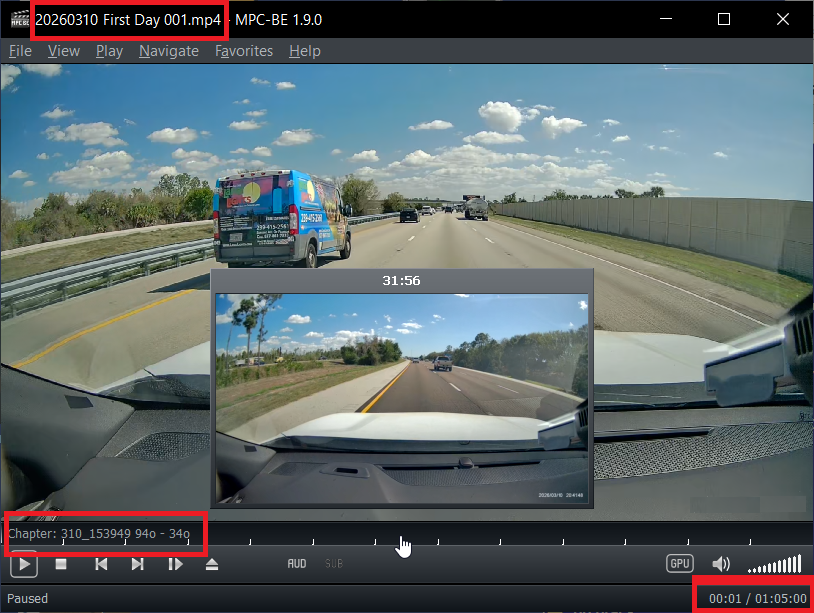
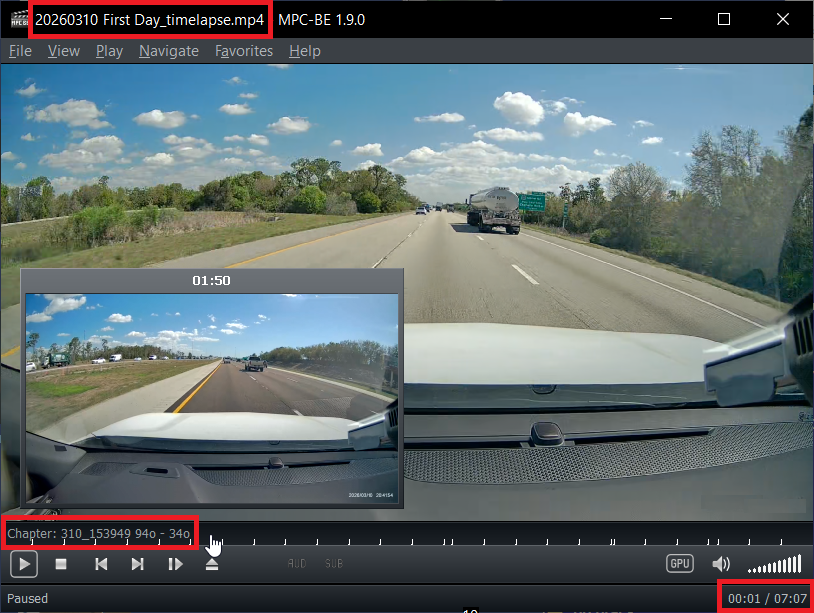
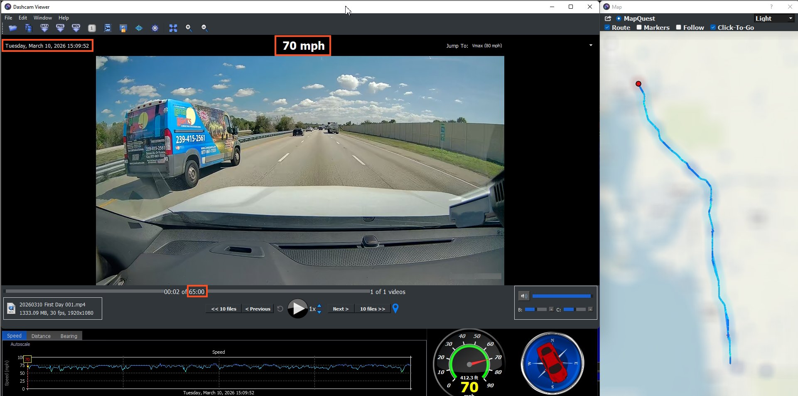
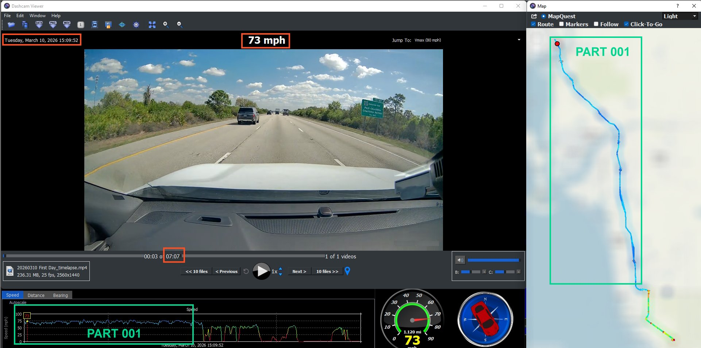
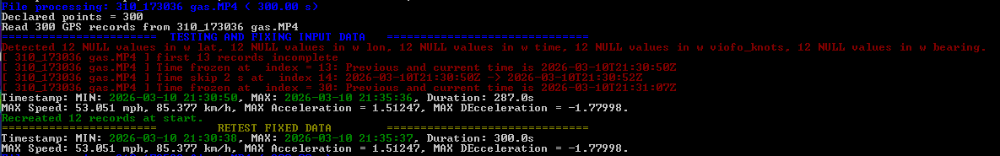
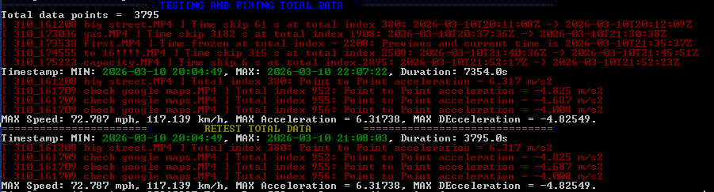

# viofo-a139-archiving-for-dashcam-viewer
Tools and workflows to archive Viofo A139 video files for GPS data visualization in Dashcam Viewer v4.0.8

# How it all started

After holidays I had 842 MP4 files from Viofo A139 Dashcam, 497 GB, in 5-minute chunks, 70 hours 11 minutes 11 seconds of video.  
Not exactly the best setup if you just want to sit back and enjoy the footage.

I was looking for a program showing video alongside the route on a map. The best free option I found was (free) `Dashcam Viewer` (v4.0.8); I thought "Easy. I’ll just merge these short clips into larger videos and re-encode them. They’ll take up less space and be way easier to watch."

Well, it wasn't that easy.

Don't want to bother you with details; after more than 6 weeks of trial and error, I finally figured out a solid workflow and built the tools to make it effortless.  
Now I want to share them with you.  
I have it all working in Windows 11. Tested also on Windows 10.  
This project started as a collection of PowerShell scripts but was eventually rewritten almost entirely in Python. This should allow it to work on other operating systems, provided the same underlying tools are available.

# Result

You can watch merged part using video player (MPC-BE) and see source file names as chapters.  
Here’s an example where I’m turning 2 hours of footage into two video clips and one timelapse. The first part is a merge of 13 videos. On the screenshot, you can see the total time is 1 hour 5 minutes, '001' is the part number in the filename, and the original video names became the chapter titles.



The same applies to timelapses. Here is a timelapse made from all source videos: the original footage was over two hours long, but the final timelapse is only seven minutes, all 28 files merged.  
Thanks to chapters in the timelapse, you can quickly see name of a specific segment and easily find it in the corresponding part.




Part 001 in Dashcam Viewer.  
In the top-left corner, you can see the time calculated by Dashcam Viewer, which is derived from the timestamp in the first file's name.  




Timelapse in Dashcam Viewer.  
As you can see, part 001 is still there, showing the correct starting time and speed, and the timelapse video is only 7 minutes long.



# Workflow overview


1. Divide the original files into phases (each phase is a leg of the trip).
2. Divide each phase into parts no longer than 65 minutes.
3. Make a timelapse in the `phase WORK FOLDER`.
4. Run `viofo_crawler.bat` in the first `part's work folder` to create compressed parts.
   
Result: Timelapse for a phase, 1-hour compressed parts for the journey archive, and a lot of GPX files.


# Prerequisites & Installation

To set up everything quickly without configuration headaches:

1. Install Python 3.10+ (make sure to check "Add Python to PATH" during installation).

2. Download this repository, extract it, and move the contents of the `Dashcamtools` folder directly into `C:\DashcamTools`.

3. Download and copy the missing binaries directly into `C:\DashcamTools`:
   - `exiftool.exe` (**v13.59 required** – older versions lack features)
   - `mp4_merge-windows64.exe` ([v0.1.11 required](https://github.com/gyroflow/mp4-merge/releases/tag/v0.1.11)). This is currently the newest version; it contains a bug, but a workaround is included.
   - `ffmpeg.exe` / `ffprobe.exe` (any recent version)
   - `HandBrakeCLI.exe` (any recent version)
   - `mkvmerge.exe` (any recent version)
   - `mp4box.exe` (any recent version)

<br>

4. Add `C:\DashcamTools` to your system `PATH`.

That's it! All scripts, config files (.json, .fmt), and external .exe tools are now together in one directory, allowing you to run the commands from any folder on your system.

## Python dependencies

Most of the libraries used in these scripts are built-in and come pre-installed with Python.  
You only need to install a few external packages before running the scripts.

To install all the required packages at once, run this command in your terminal:
```bash
pip install pandas pandasql numpy tabulate ipython
```

Here is the full, combined list of imports used across all python scripts:

```python
import argparse
import glob
import io
import json
import math
import os
import re
import shutil
import struct
import subprocess
import sys
import warnings
import winsound
import xml.etree.ElementTree as ET
from contextlib import redirect_stdout
from datetime import datetime, timezone, timedelta
from pathlib import Path

# External packages (need to be installed via pip)
from IPython.display import display, HTML, Javascript
import numpy as np
import pandas as pd
from pandasql import sqldf
from tabulate import tabulate
```

# Organizing Viofo files

Original files

```
2026-03-10  11:45       719 178 632 2026_0310_114038_F.MP4
2026-03-10  11:50       719 159 392 2026_0310_114538_F.MP4
2026-03-10  11:52       238 771 964 2026_0310_115038_F.MP4
2026-03-10  12:20       318 336 796 2026_0310_121818_F.MP4
2026-03-10  12:28       137 560 600 2026_0310_122727_F.MP4
2026-03-10  12:34       719 151 032 2026_0310_122917_F.MP4
2026-03-10  12:39       719 178 668 2026_0310_123417_F.MP4
2026-03-10  12:40       124 790 816 2026_0310_123917_F.MP4
2026-04-04  02:57    <DIR>          Parking
2026-04-04  03:02    <DIR>          RO
             716 File(s) 477 734 172 146 bytes
```
First, I renamed the files to the "MDD_HHMMSS" format (for example, renaming "2026_0310_114038_F.MP4" to "310_114038_F.MP4"). I did this to make the video chapters more readable.
 
Then, I watched the videos and added comments directly to the filenames to remember if something interesting was recorded.  
I also sorted the files into journey phases;  
Once a folder is named like this (e.g., "20260310 First Days"), it becomes the `phase work folder`.  
Think of each phase as a single leg of your trip like a specific destination or a few days of driving.

**Note**: I had a massive amount of footage, so this structure worked best for me.  
If you don't have that many, feel free to just put everything into one `phase`.

Inside the prepared `phase work folder`:
```
2026-03-10  21:14       719 168 612 310_150949.MP4
2026-03-10  16:19       719 161 720 310_151449.MP4
2026-03-10  21:24       719 168 952 310_151949.MP4
2026-03-10  21:29       719 170 676 310_152449.MP4
2026-03-10  21:34       719 167 740 310_152949.MP4
2026-03-10  21:39       719 166 408 310_153449 highway.MP4
2026-03-10  21:44       719 164 136 310_153949 94o - 34o.MP4
2026-03-10  21:49       719 162 184 310_154449.MP4
2026-03-10  21:49       719 162 184 310_154949.MP4
2026-03-10  21:54       719 164 668 310_155449.MP4
2026-03-10  21:59       719 167 640 310_155949.MP4
2026-03-10  21:59       719 167 640 310_160449.MP4
2026-03-10  22:04       719 173 020 310_160949 highway.MP4
2026-03-10  22:09       719 168 184 310_161449 highway.MP4
2026-03-10  22:11       193 088 140 310_161949 highway.MP4
2026-03-10  17:17       719 156 572 310_162208 highway.MP4
2026-03-10  22:22       719 162 480 310_162709 highway.MP4
2026-03-10  22:27       719 159 060 310_163209.MP4
2026-03-10  22:32       719 166 584 310_163709.MP4
2026-03-10  22:37       719 166 076 310_164209 highway.MP4
2026-03-10  22:37        67 934 844 310_164709.MP4
2026-03-10  23:35       719 149 484 310_173036 highway.MP4
2026-03-10  23:40       719 174 716 310_173538 highway.MP4
2026-03-10  23:50       164 354 632 310_174555.MP4
2026-03-10  23:52        47 935 488 310_175055.MP4
2026-03-10  23:57       719 153 560 310_175223.MP4
2026-03-11  00:02       719 162 236 310_175724.MP4
2026-03-11  00:07       719 172 556 310_180224.MP4
              28 File(s) 17 733 270 192 bytes
```

Originally, I wanted to merge the files into one massive video for each `phase`. However, there is a hidden limit in `Dashcam Viewer` (DV).

It turns out DV has trouble processing GPX files when their total duration is too high (the time from the first timestamp to the last one). The data cannot last more than about 4000 seconds. I don't know the exact value, but 3900 seconds is totally fine, while 4200 seconds causes issues. If a GPX file exceeds 65 minutes, the GPS track becomes corrupted, causing the route to either disappear or render lines all around the globe. 

This was actually my biggest headache. I spent way too much time trying to develop these scripts using a test video that, by pure coincidence, happened to be 72 minutes long! 

So, if you keep the total time below 65 minutes and avoid special characters in the filenames, everything works perfectly.

Here is an example of corrupted GPS data (DV export), with complete garbage showing up at the beginning:

```
*******************************************************************************
  <trk>
    <name>Track Start Time: 2038-02-15T04:15:10Z</name>
    <trkseg>
      <trkpt lat="1260774664613771490066256662699220444105886599913690644404052601210152510492781454505059517013209842566129413193090710408784170564685579510361226921755070096261233657453577979973960526810907996745367552.0000000" lon="0.0000000">
        <ele>0.0</ele>
        <time>2038-02-15T04:15:10Z</time>
        <speed>-nan</speed>
      </trkpt>
      <trkpt lat="-0.0000000" lon="340584802760130.5625000">
        <ele>0.0</ele>
        <time>2038-03-04T23:50:26Z</time>
        <speed>-0.9</speed>
      </trkpt>
      <trkpt lat="-1732763182135895315923130280818233839123794595688862002831780083941980778065252611674661916065308350928155360483191986693733220332035029617214705880944082944.0000000" lon="0.0000000">
        <ele>0.0</ele>
        <time>2038-03-06T21:39:13Z</time>
        <speed>-9966948294471704576.0</speed>
      </trkpt>
      <trkpt lat="1260776811415832496558754283288437382128857893520707784112944248463007707022792845350381220358856136187994239578658338641383439705854031562702158401405148377060473186838068622091272054945120770104229888.0000000" lon="1.8296063">
        <ele>0.0</ele>
        <time>2038-03-12T15:05:33Z</time>
        <speed>-0.0</speed>
*******************************************************************************
```

So, when the files in the `work folder` last more than 65 minutes, we have to divide them into shorter parts.  
To make checking this easier, I created a script called `mp4times.bat` (calling `mp4times.py`). When you run it in a folder with MP4 files, it generates a TXT file named `mp4_28files_total_time_7696s_02h08m16s366ms.txt` showing total duration of files in seconds, and in hours/minutes/seconds/miliseconds.
Based on this output, you can easily calculate how many parts you need to create. In this example, I needed to create two parts.

So, I create subfolders inside the main phase folder and name them ...001 and ...002. These will be our `part work folders`. Then, I copy the MP4 files into these folders, ensuring no part exceeds the 65-minute limit (you can use `mp4times.bat` again to double-check this).

```
20260310 First Days /
├── 20260310 First Days 001 /
│   ├── 310_150949.MP4
│   ├── 310_151449.MP4
│   .......
│   └── 310_160949 highway.MP4
└── 20260310 First Days 002 /
    ├── 310_161449 highway.MP4
    .......
    └── 310_180224.MP4
```

# Re-encoding and processing

Everything is prepared, so now we can start the real work.

## Parts Re-encode
I go to the first `part work folder`, "20260310 First Days 001" and run `viofo_crawler.bat`. This script runs `viofo2one.py`, which re-encodes the videos using `handbrakeCLI` and a custom `viofo1080slow32h265bit10.json` template. It changes the resolution to 1920x1080 and encodes everything in x265.
When it finishes, it automatically checks if the next folder (e.g., `...002`) exists.  
If it does, the script switches to that next folder and runs `viofo2one.py` again.  
It repeats this loop until there are no more folders left.  
If something fails along the way, you can easily restart from the last unfinished folder.  
For example, if `part 001` completed successfully but `part 002` failed, you can just start the script directly inside `002` and it will continue from there.

## Phase Timelapse
There is one more thing to do in the `phase work folder`: the scripts can create a timelapse (hyperlapse). I chose an 18x speed increase.  
Running `viofo2one.bat 1` creates a timelapse with `ffmpeg` in the original resolution. It also automatically calls the `viofo2one_gpx.py` script with the "t" parameter. This produces a `work folder_timelapse.gpx` file with timestamps shrunk 18 times to match the video speed, while keeping the real-world driving data. The script actually generates two different timelapse GPX files:
- `work folder_timelapse_compressed.gpx` contains all GPS records with the timeline adjusted to match the exact duration of the timelapse video. DV has no issues showing this route, even with more than 25,000 records (since the accelerated video duration for this records count had only around 24 minutes). This proves DV cares about the total duration, not the number of points, as it struggled with a 70-minute drive containing only 4,200 records.
- `work folder_timelapse.gpx` contains exactly one GPS point per second, which is the optimization that DV does by itself.

## Results

The final results are:
- The `phase timelapse` video (MP4) and its corresponding tracking file (GPX).
- The compressed 1-hour `parts` videos (MP4) and their GPX files.

All of these generated files are fully compatible and ready ready to be viewed in Dashcam Viewer.


```
2026-07-31  18:05            50 461 20260310 First Day_timelapse.gpx
2026-03-10  16:16       241 980 940 20260310 First Day_timelapse.mp4
2026-08-03  00:42    <DIR>          20260310 First Day 001 exiftool gpx
2026-08-03  00:42    <DIR>          20260310 First Day 001 skrypt gpx
2026-08-01  02:39           456 767 20260310 First Day 001.gpx
2026-03-10  17:14     1 365 083 411 20260310 First Day 001.mp4
2026-07-31  23:59               419 20260310 First Day 001_files.txt
2026-08-03  00:46    <DIR>          20260310 First Day 002 exiftool gpx
2026-08-03  00:46    <DIR>          20260310 First Day 002 skrypt gpx
2026-08-01  15:20           442 520 20260310 First Day 002.gpx
2026-03-10  18:08     1 595 073 964 20260310 First Day 002.mp4
2026-08-01  02:39               484 20260310 First Day 002_files.txt
2026-07-31  17:23               903 20260310 First Day_files.txt
               9 File(s)  3 203 089 869 bytes
```


# viofo2one_gpx.py explained

The script works inside the `work folder`. It checks all MP4 files and extracts their GPS data into GPX files.

GPS data can often have various issues. This script automatically detects and tries to fix them.
Files are generated in a subfolder named `temp`:

```
20260310 First Days 001 /
├── 310_150949.MP4
├── 310_151449.MP4
.......
├── 310_155949 highway.MP4
└── temp /
    ├── 20260310 First Day 001 exiftool gpx /
    │   ├── 310_150949_exiftool.gpx
    │   ├── 310_151449_exiftool.gpx
    │   .......
    │   └── 310_160949 highway_exiftool.gpx
    ├── 20260310 First Day 001 skrypt gpx
    │   ├── 20260310 First Day 001_with_bearing.gpx
    │   ├── 310_150949_skrypt.gpx
    │   ├── 310_151449_skrypt.gpx
    │   .......
    │   └── 310_160949 highway_skrypt.gpx
    └── 20260310 First Day 001.gpx
```

The subfolder `work folder exiftool gpx` contains GPX files extracted with `exiftool`. 
The `gpxVIOFO_A139.fmt` file is the configuration template used by `exiftool` to format the GPX output when exporting Viofo data (which we already set up in the Prerequisites section).

The subfolder `work folder skrypt gpx` contains GPX files generated by my script. While exiftool simply writes what it found, skipping unreadable data, my script does its best to maintain perfect video synchronization and timestamp continuity.  

The `work folder.gpx` file contains all the merged GPS data.  
Inside `work folder skrypt gpx`, the `work folder_with_bearing.gpx` file contains the same merged data, but includes Viofo's hardware bearing information.  
As far as I know, the built-in GPS chip has much more accurate speed and bearing data than what can be mathematically calculated from raw GPS coordinates.

`Dashcam Viewer` reads the speed data from the GPX file but ignores the bearing, as it is non-standard information for the GPX format. Perhaps there is a non-standard way to make DV read it, but I haven't found it yet.  
Therefore, the file with bearing data cannot be used directly in DV, but I keep it in the journey archive for future use.


# viofo2one.py explained

To make running it easier, you don't need to type the full Python path. Instead, you can just use the helper `viofo2one.bat` file.

## Re-encode

The script's default mode is `re-encode`, which runs when you provide no parameters. In this mode, the script performs several key functions:
- It calls `viofo2one_gpx.py` to extract and merge all the GPX data (as described in the previous sections).
- It merges all the video files and extracts the original audio track.
- It resizes the combined video to 1080p and compresses it into an x265 file using `handbrakeCLI` with the `viofo1080slow32h265bit10.json` template.  
In HandBrake GUI you can define yours.

In addition to the GPX files described earlier, the script generates these new files inside the `temp` folder:

```
20260310 First Day\20260310 First Day 001\temp> dir
<DIR>          20260310 First Day 001 exiftool gpx
<DIR>          20260310 First Day 001 skrypt gpx
       456˙767 20260310 First Day 001.gpx
 1˙365˙083˙411 20260310 First Day 001.mp4
           419 20260310 First Day 001_files.txt
    31˙623˙189 20260310 First Day 001_ORG.aac
 9˙348˙773˙194 20260310 First Day 001_ORG.mp4
        11˙679 gpx2one.log
               6 File(s) 10˙745˙948˙688 bytes
```

`20260310 First Day 001_ORG.mp4`: The merged video file in its original size and quality.  
`20260310 First Day 001_ORG.aac`: The extracted audio track from the merged video.  
`20260310 First Day 001_files.txt`: A list of the merged video files with their timestamps. This file automatically becomes the chapter list for the final re-encoded video.  
`20260310 First Day 001.mp4`: The final re-encoded video, complete with chapters. It is designed to be used alongside the `20260310 First Day 001.gpx` file in Dashcam Viewer.
`gpx2one.log` log from viofo2one_gpx script with statistics of extracted files and detected anomalies.  
You can use showlog.bat to display this log with color-coded formatting. If any anomalies are detected (which will be highlighted in red), you can convert the GPX file into a CSV file for closer inspection. To do this, run `gpx2csv.bat file.GPX`, which calls `gpx2csv.py`.

Example log for source file processing:  



Example log for merged data processing:  




## Timelapse

When the script `viofo2one.bat` is started with the parameter 1, it produces an 18x timelapse video with accelerated chapters. It also triggers a special mode in viofo2one_gpx.py to generate accelerated GPX files.

```
20260310 First Day\temp>> dir temp
       898˙820 20260310 First Day.gpx
           903 20260310 First Day_files.txt
           199 20260310 First Day_ORG.gpx
17˙732˙366˙632 20260310 First Day_ORG.mp4
        50˙461 20260310 First Day_timelapse.gpx
   241˙980˙940 20260310 First Day_timelapse.mp4
       898˙681 20260310 First Day_timelapse_compressed.gpx
        39˙722 gpx2one.log
```

### Automatic video file timestamp correction

For both regular videos and timelapses, the script automatically updates the time attribute of the re-encoded file so that Dashcam Viewer displays the correct trip start time. 

In this example, to make DV show `2026-03-10 15:09:49`, the file's timestamp is actually set to the start time plus the total video duration. DV performs this algebra in reverse, subtracting the duration from the file time to display the exact time of beginning of the video.

If you ever need to perform this action by hand, you can use the helper script `viofo_settime.bat` to change the file time manually.  
It requires two parameters: the target date and time in the `YYYYMMDD_HHMMSS` format and the video filename,  
example `viofo_settime 20260310_150949 "20260310 First Day 001.mp4"`


